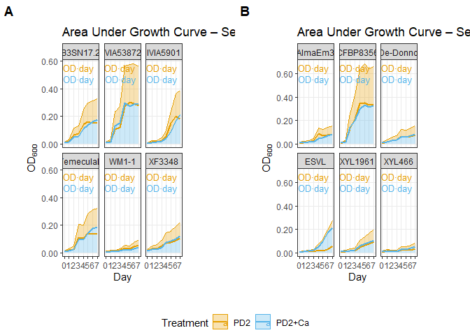

Load Required Libraries

``` r
library(dplyr)
```

    ## Warning: package 'dplyr' was built under R version 4.3.3

    ## 
    ## Attaching package: 'dplyr'

    ## The following objects are masked from 'package:stats':
    ## 
    ##     filter, lag

    ## The following objects are masked from 'package:base':
    ## 
    ##     intersect, setdiff, setequal, union

``` r
library(tidyr)
```

    ## Warning: package 'tidyr' was built under R version 4.3.3

``` r
library(gcplyr)
```

    ## Warning: package 'gcplyr' was built under R version 4.3.3

    ## ## 
    ## ## gcplyr (Version 1.11.0, Build Date: 2025-01-16)
    ## ## See http://github.com/mikeblazanin/gcplyr for additional documentation
    ## ## Please cite software as:
    ## ##   Blazanin, Michael. gcplyr: an R package for microbial growth
    ## ##   curve data analysis. BMC Bioinformatics 25, 232 (2024).
    ## ##   https://doi.org/10.1186/s12859-024-05817-3
    ## ##

``` r
library(ggplot2)
```

    ## Warning: package 'ggplot2' was built under R version 4.3.3

``` r
library(scales)
```

    ## Warning: package 'scales' was built under R version 4.3.2

``` r
library(ggpubr)
```

    ## Warning: package 'ggpubr' was built under R version 4.3.3

``` r
library(patchwork)
```

    ## Warning: package 'patchwork' was built under R version 4.3.3

Define custom color palette

``` r
cbPalette <- c(PD2 = "#E69F00", `PD2+Ca` = "#56B4E9")
```

1.  Define Data Processing Function

``` r
process_growth_data <- function(file_path, day_number) {
  read.csv(file_path) %>%
    select(-X.1) %>%
    mutate(row_id = row_number()) %>%
    filter(!is.na(X) & X != "") %>%
    mutate(Plate = rep(1:3, each = 8, length.out = n())) %>%
    group_by(Plate) %>%
    mutate(
      PD2_blank   = rowMeans(across(X1:X12)[X == "A", ]),
      PD2Ca_blank = rowMeans(across(X1:X12)[X == "H", ])
    ) %>%
    mutate(
      across(X1:X6,  ~ . - PD2_blank),
      across(X7:X12, ~ . - PD2Ca_blank)
    ) %>%
    ungroup() %>%
    pivot_longer(X1:X12, names_to = "Variable", values_to = "OD") %>%
    mutate(
      Treatment = case_when(
        Variable %in% paste0("X", 1:6)  ~ "PD2",
        Variable %in% paste0("X", 7:12) ~ "PD2+Ca"
      ),
      Day = day_number
    ) %>%
    filter(!X %in% c("A", "H"))
}
```

2.  Process Dataset A

``` r
all_days_A <- lapply(0:7, function(i) {
  process_growth_data(paste0("Growth_curve_IDE_5/A_", i, ".csv"), i)
})

combined_data_A <- bind_rows(all_days_A) %>%
  rename(Strains = X) %>%
  mutate(
    Strains = recode(Strains,
                     B = "WM1-1", C = "B3SN17.2", D = "TemeculaL",
                     E = "IVIA53872", F = "XF3348", G = "IVIA5901"),
    Dataset = "Set A"
  )

write.csv(combined_data_A, "combined_data_A.csv", row.names = FALSE)
```

3.  Process Dataset B

``` r
all_days_B <- lapply(0:7, function(i) {
  process_growth_data(paste0("Growth_curve_IDE_5/B_", i, ".csv"), i)
})

combined_data_B <- bind_rows(all_days_B) %>%
  rename(Strains = X) %>%
  mutate(
    Strains = recode(Strains,
                     B = "ESVL", C = "AlmaEm3", D = "CFBP8356",
                     E = "XYL466", F = "De-Donno", G = "XYL1961"),
    Dataset = "Set B"
  )

write.csv(combined_data_B, "combined_data_B.csv", row.names = FALSE)
```

4.  Plot AUC by Strain & Treatment

``` r
plot_auc_set <- function(df, set_name) {
  mean_data <- df %>%
    group_by(Strains, Treatment, Day) %>%
    summarise(mean_OD = mean(OD, na.rm = TRUE), .groups = "drop")
  
  lbls <- mean_data %>%
    group_by(Strains, Treatment) %>%
    summarise(auc = tryCatch(auc(Day, mean_OD), error = function(e) NA), .groups = "drop") %>%
    left_join(mean_data %>% group_by(Strains) %>% summarise(max_od = max(mean_OD)), by = "Strains") %>%
    mutate(label = paste0(round(auc, 2), " OD·day"))
  
  ggplot(mean_data, aes(Day, mean_OD, color = Treatment, fill = Treatment)) +
    geom_area(alpha = 0.3) +
    geom_line(size = 1) +
    geom_text(
      data = lbls,
      aes(x = Inf, y = Inf, label = label),
      hjust = 1.1,
      vjust = ifelse(lbls$Treatment == "PD2", 1.5, 3),
      size = 3.5
    ) +
    facet_wrap(~ Strains) +
    scale_color_manual(values = cbPalette) +
    scale_fill_manual(values = cbPalette) +
    scale_x_continuous(breaks = 0:7) +
    scale_y_continuous(labels = number_format(accuracy = 0.01)) +
    labs(
      x = "Day",
      y = expression(OD[600]),
      title = paste("Area Under Growth Curve –", set_name)
    ) +
    theme_bw() +
    theme(
      legend.position = "top",
      panel.grid.minor = element_blank(),
      plot.margin = margin(1, 2, 1, 1, "cm")
    )
}
```

Plotting the Sets using ggplot

``` r
plot_A <- plot_auc_set(combined_data_A, "Set A")
```

    ## Warning: Using `size` aesthetic for lines was deprecated in ggplot2 3.4.0.
    ## ℹ Please use `linewidth` instead.
    ## This warning is displayed once every 8 hours.
    ## Call `lifecycle::last_lifecycle_warnings()` to see where this warning was
    ## generated.

``` r
plot_B <- plot_auc_set(combined_data_B, "Set B")

library(ggpubr)

combined_auc_plot <- ggarrange(
  plot_A, plot_B,
  ncol = 2,
  common.legend = TRUE,
  legend = "bottom",
  labels = c("A", "B")
)

combined_auc_plot
```

<!-- -->

5.  Plot Growth Curves with Error Ribbons

``` r
plot_growth_curve <- function(df, set_title) {
  ggplot(df, aes(x = Day, y = OD, color = Treatment)) +
    stat_summary(fun = mean, geom = "line", aes(group = Treatment), size = 1) +
    stat_summary(fun.data = mean_se, geom = "ribbon", aes(fill = Treatment), alpha = 0.2, color = NA) +
    facet_wrap(~ Strains, scales = "free_y") +
    scale_color_manual(values = cbPalette) +
    scale_fill_manual(values = cbPalette) +
    scale_x_continuous(breaks = 0:7) +
    scale_y_continuous(labels = number_format(accuracy = 0.01)) +
    labs(
      x = "Day",
      y = expression(OD[600]),
      title = set_title
    ) +
    theme_bw() +
    theme(
      legend.position = "top",
      panel.grid.minor = element_blank(),
      plot.margin = margin(1, 2, 1, 1, "cm")
    )
}
```

Plotting the growthcurves

``` r
library(patchwork)

growth_curve_A <- plot_growth_curve(combined_data_A, "Growth Curves: Set A")
growth_curve_B <- plot_growth_curve(combined_data_B, "Growth Curves: Set B")

combined_growth_plot <- growth_curve_A + growth_curve_B +
  plot_layout(ncol = 2, guides = "collect") &  # Collect legends
  theme(legend.position = "bottom")  # Position collected legend
```

Print the combined plot with a single common legend

``` r
print(combined_growth_plot)
```


